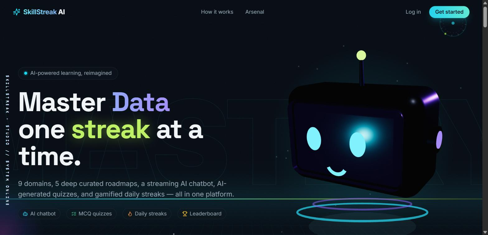
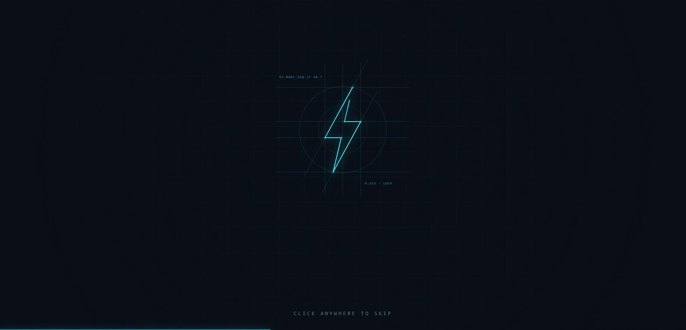
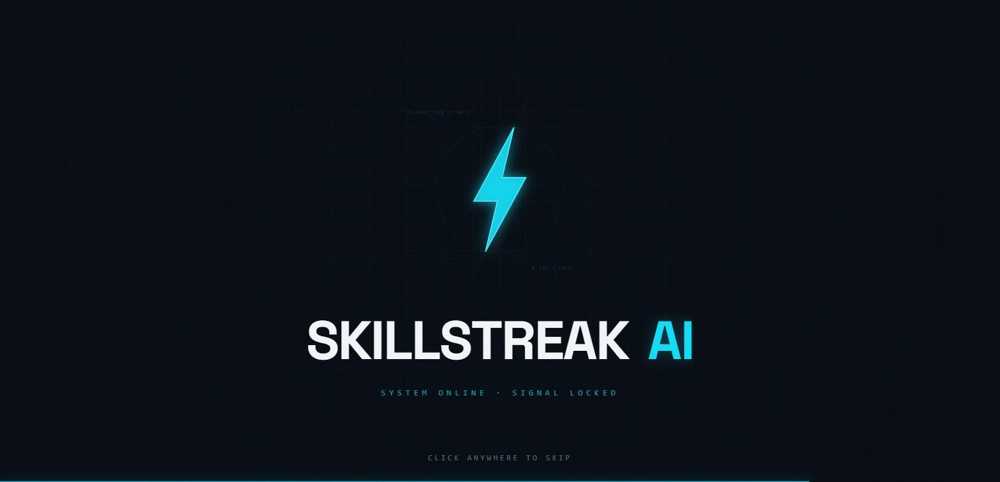
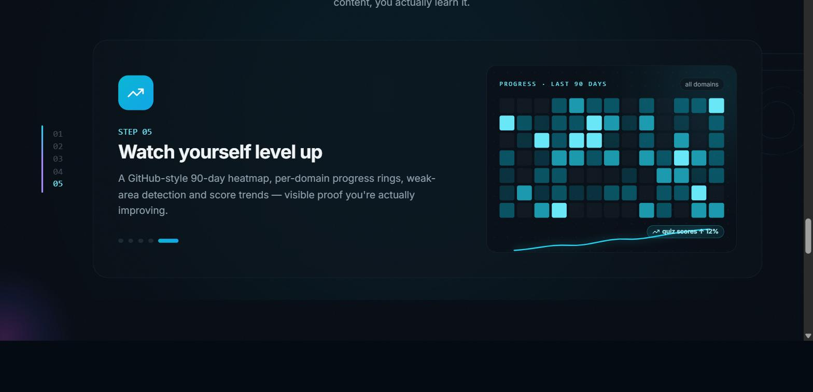

<div align="center">

# SkillStreak AI

**Learn tech skills the way you'd play a game — streaks, XP, and an AI tutor that never sleeps.**

Pick a technology domain, meet an AI mentor that builds you a personalized roadmap, chat with a streaming tutor, pass AI-generated quizzes, and keep your daily streak alive while you climb the leaderboard.

[](https://github.com/Likith2005-coder/SkillStreak-AI/actions/workflows/ci.yml)
[](LICENSE)




</div>

---

## ✨ Features

| | Feature | What it does |
|---|---|---|
| 🧭 | **AI onboarding assessment** | Picking a domain doesn't dump you on a roadmap. A conversational mentor asks one question at a time — goals, level, time budget, learning style, target role, certifications — then generates a learner profile and a roadmap built for *you*. |
| 🤖 | **Streaming AI tutor** | Topic-aware, level-aware chat with intent-classified follow-ups. Every conversation persists; code blocks render with copy buttons. |
| 🗺️ | **Curated + personalized roadmaps** | 9 technology domains. Curated paths visualized as a Duolingo-style winding trail, plus AI-generated phased plans with resources, exercises, mini-projects and a capstone. |
| 📝 | **AI quizzes** | 5 MCQs per topic, generated then validated by a second LLM pass. Pass 3/5 to complete a topic. |
| 🔁 | **Adaptive difficulty** | Quiz scores feed back into the plan — below 70% flags a topic for revision, above 90% unlocks skipping ahead. |
| 🔥 | **Streaks, XP & badges** | Daily streaks with auto-spent freezes, level math via `100·N·log₂(N+1)`, 8 unlockable badges, weekly leaderboard. |
| 📊 | **Progress analytics** | GitHub-style 90-day heatmap, per-domain progress rings, weak-area detection, score-trend charts. |
| 💀 | **Ethical Hacking Arsenal** | Every phase of a real penetration test with 37+ real tools and AI-generated field guides — inside a full hacker terminal UI. |
| 💼 | **Career paths & interview prep** | Role roadmaps per domain plus AI-driven interview practice. |
| 🎯 | **Personalized recommendations** | pgvector similarity matching surfaces the best next topic for each learner. |
| 🛠️ | **Admin console** | Separate admin app for metrics, topic management, users, and email digests. |

## 📸 Screenshots

<table>
<tr>
<td width="50%"></td>
<td width="50%"></td>
</tr>
<tr>
<td colspan="2" align="center"><em><strong>Signal Boot</strong> — construction guides draw themselves through the vertices of the streak bolt, which then ignites into the wordmark before the curtain lifts into the page.</em></td>
</tr>
<tr>
<td colspan="2"></td>
</tr>
<tr>
<td colspan="2" align="center"><em><strong>Pinned scroll story</strong> — five integrated systems, one per viewport, each with its own live vignette.</em></td>
</tr>
</table>

## 🏗️ Architecture

npm-workspaces monorepo with three apps:

```
skillstreak-ai/
├── frontend/     Next.js 14 learner app (Tailwind, shadcn/ui, Framer Motion, GSAP)  → :3000
├── backend/      Express + TypeScript API (Prisma, PostgreSQL + pgvector, Redis)    → :4000
├── admin/        Next.js admin console                                              → :3001
├── docs/         Architecture, API & database documentation
├── planning/     System design & engineering docs
└── docker-compose.yml   Local Postgres + Redis
```

**AI:** Google Gemini powers the tutor, the onboarding assessment and plan generation, quiz generation/validation, tool field guides, and interview prep. Embeddings + pgvector drive personalized recommendations. A circuit breaker guards all LLM calls, and generated resources are constrained to real, stable URLs — never invented ones.

**Gamification engine:** streak tracking with freeze auto-spend, XP economy, level curve, badge unlock rules, and weekly leaderboard aggregation — all server-side.

**Design:** a dark-locked design system called **Signal** — deep-ink console, electric cyan as the live signal, violet for depth, lime reserved for streak energy. Every animation ships with a `prefers-reduced-motion` fallback as a hard invariant. See [`frontend/DESIGN.md`](frontend/DESIGN.md).

## 🚀 Getting Started

**Prerequisites:** Node.js ≥ 20, npm ≥ 10, Docker Desktop, Git

```powershell
# 1. Install dependencies (root + all workspaces)
npm install

# 2. Start Postgres + Redis
npm run db:up

# 3. Configure environment
Copy-Item backend/.env.example backend/.env
Copy-Item frontend/.env.example frontend/.env.local
# add your GEMINI_API_KEY to backend/.env

# 4. Run database migrations
npm --workspace backend run db:migrate

# 5. Start all three apps
npm run dev
```

| App | URL |
|---|---|
| Learner app | http://localhost:3000 |
| Backend API | http://localhost:4000 |
| Admin console | http://localhost:3001 |

> **Tip:** the landing page plays its boot intro once per browser session. Add `?intro=1` to replay it.

## 📜 Scripts

| Script | What it does |
|---|---|
| `npm run dev` | Start frontend + backend + admin in parallel |
| `npm run dev:frontend` / `dev:backend` / `dev:admin` | Start a single app |
| `npm run build` | Production build (backend + frontend) |
| `npm run lint` | Lint all workspaces |
| `npm run test` | Run all test suites |
| `npm run type-check` | TypeScript check across all workspaces |
| `npm run db:up` / `db:down` / `db:logs` | Manage local Postgres + Redis containers |

## 📚 Documentation

- [`docs/architecture.md`](docs/architecture.md) — system architecture
- [`docs/api.md`](docs/api.md) — API reference
- [`docs/database.md`](docs/database.md) — database schema
- [`frontend/DESIGN.md`](frontend/DESIGN.md) — the **Signal** design system
- [`planning/`](planning/) — system design & engineering process docs
- [`CONTRIBUTING.md`](CONTRIBUTING.md) — development workflow and conventions
- [`SECURITY.md`](SECURITY.md) — reporting a vulnerability

## 🧰 Tech Stack

**Frontend** — Next.js 14 (App Router), TypeScript, Tailwind CSS, shadcn/ui, Framer Motion, GSAP + ScrollTrigger, Lenis, react-three-fiber (the custom SignalBot mascot), Zustand, Recharts
**Backend** — Express, TypeScript, Prisma, PostgreSQL + pgvector, Redis, Zod, JWT auth, rate limiting
**AI** — Google Gemini (chat, assessment + plan generation, quiz gen + validation, embeddings), circuit-breaker-protected
**Infra** — Docker Compose (local), Supabase (Postgres hosting), GitHub Actions CI

## 📄 License

[MIT](LICENSE) © Likith
