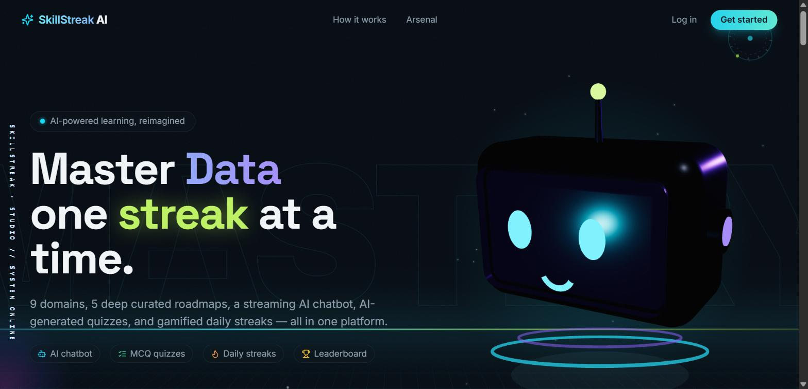
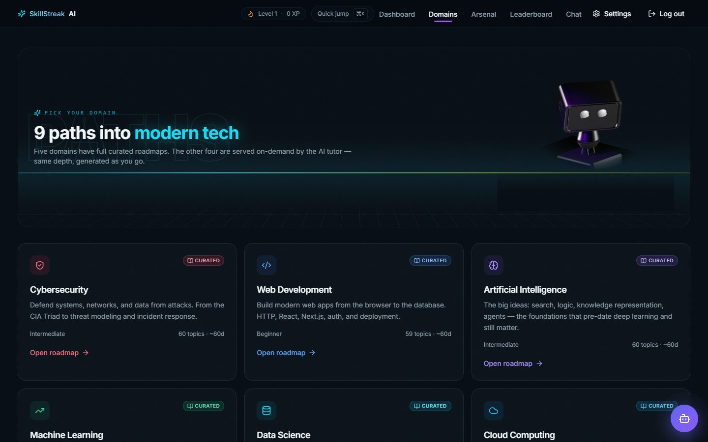
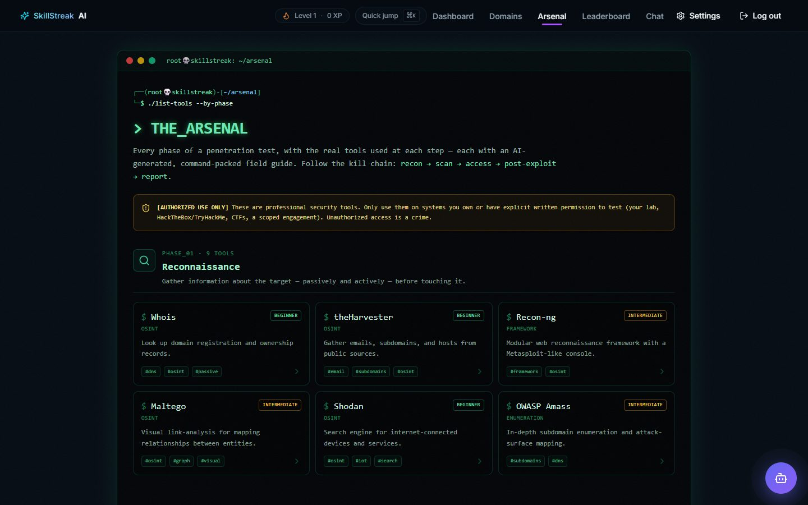
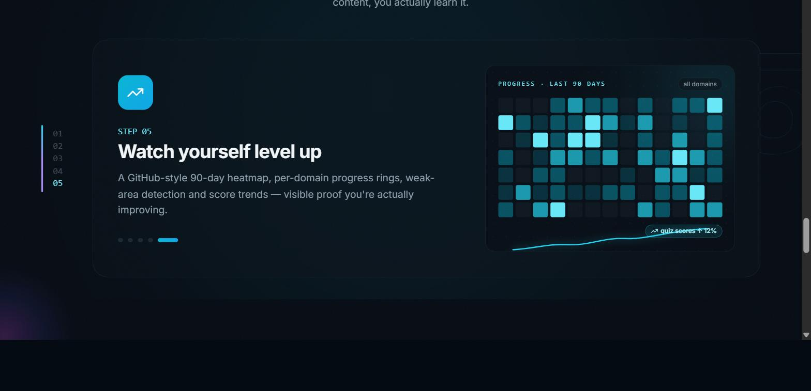
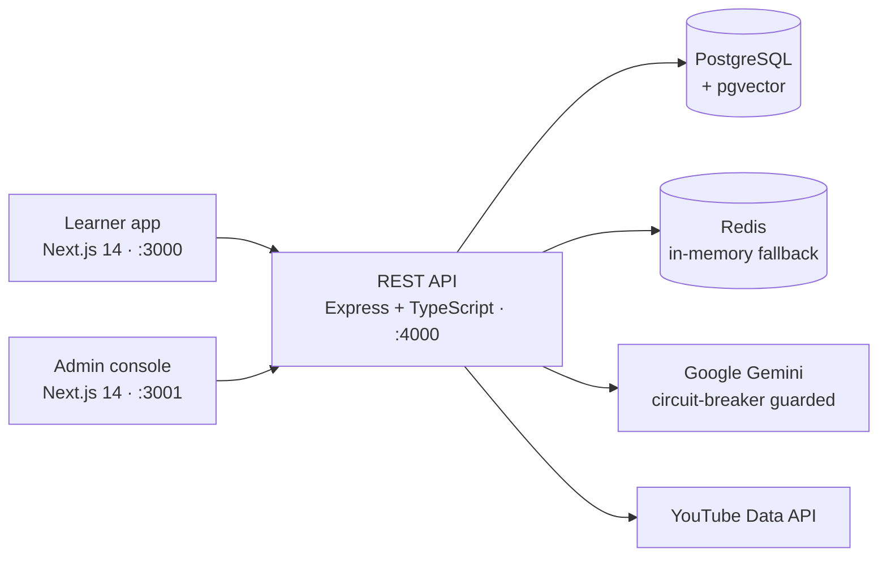

<div align="center">


# SkillStreak AI

**Structured mastery of modern tech — guided by an AI mentor, kept alive by streaks.**

A learning console you operate, not a course catalog you browse.

[](https://github.com/Likith2005-coder/SkillStreak-AI/actions/workflows/ci.yml)
[](LICENSE)




</div>

## Why

Self-learners don't fail for lack of content. They fail because nothing tells them what to do next, and nothing makes them come back tomorrow. SkillStreak fixes both: an AI mentor builds a plan around *you*, and a streak makes continuing the obvious move.

## What it does

| | |
|---|---|
| **AI mentor assessment** | Pick a domain and a mentor asks one question at a time — goal, level, daily time, learning style, target role, certifications, OS. It then writes your learner profile and a phased roadmap that visibly reacts to your answers. |
| **Personalized roadmap** | Each phase ships objectives, a beginner explanation, videos, docs, practice sites, exercises, a mini-project and a milestone — plus a step-by-step capstone and a day-by-day Week 1. |
| **Adaptive difficulty** | Quiz scores feed back into the plan: under 70% flags a topic for revision, over 90% unlocks skipping ahead. |
| **Streaming AI tutor** | Topic-aware, level-aware chat with saved conversations and copy-ready code. |
| **Validated quizzes** | Five MCQs per topic, generated then checked by a second LLM pass. Pass 3/5 to clear the topic. |
| **Streaks, XP & badges** | Daily streaks with auto-spent freezes, a `100·N·log₂(N+1)` level curve, unlockable badges and a weekly leaderboard. |
| **Progress analytics** | 90-day activity heatmap, per-domain progress rings, weak-area detection, score trends. |
| **Ethical Hacking Arsenal** | Every phase of a real penetration test with 37+ tools and AI field guides, inside a terminal UI. |
| **Career & interview prep** | Role roadmaps per domain and AI-driven mock interviews, unlocked by finishing a trail. |

Nine domains: Cybersecurity · Web Development · AI · Machine Learning · Data Science · Cloud · DevOps · Blockchain · IoT.

## Screenshots

<table>
<tr><td></td></tr>
<tr><td align="center"><sub><b>Pick your domain</b> — nine tracks, each with a curated roadmap or one generated on demand by the AI tutor.</sub></td></tr>
<tr><td></td></tr>
<tr><td align="center"><sub><b>Ethical Hacking Arsenal</b> — the penetration-testing methodology phase by phase, with a guide for every tool. Learning reference only; it runs nothing.</sub></td></tr>
<tr><td></td></tr>
<tr><td align="center"><sub><b>Progress analytics</b> — heatmap, score trend and weak-area detection.</sub></td></tr>
</table>

## Architecture


```mermaid
flowchart LR
    L[Learner app<br/>Next.js 14 · :3000] --> API
    A[Admin console<br/>Next.js 14 · :3001] --> API
    API[REST API<br/>Express + TypeScript · :4000] --> DB[(PostgreSQL<br/>+ pgvector)]
    API --> R[(Redis<br/>in-memory fallback)]
    API --> G[Google Gemini<br/>circuit-breaker guarded]
    API --> Y[YouTube Data API]
```

An npm-workspaces monorepo:

```
frontend/   learner app — Tailwind, Framer Motion, GSAP, Lenis, react-three-fiber
backend/    API — Prisma, Zod, JWT, rate limiting, LLM + YouTube services
admin/      admin console — metrics, topics, users, email digests
docs/       architecture, API and database reference
```

**AI you can trust.** Every LLM call runs through a circuit breaker. Generated learning resources are never allowed to invent URLs: they cite well-known stable pages or emit a search query the UI resolves, and videos are verified live before they're shown.

**Built to be fast.** Production Lighthouse scores **99 / 100 / 100 / 100** on desktop and **90** on throttled mobile. The 3D mascot and WebGL wordmark only load on devices with a pointer that can drive them; phones get a static SVG instead of 667 kB of three.js. Scroll-path animations run on the compositor, and heavy charts are code-split.

**Designed as a system.** A dark-locked design language called **Signal** — deep ink, cyan as the live signal, violet for depth, lime reserved for streak energy. Every animation has a reduced-motion fallback and every text pair clears WCAG AA. See [`frontend/DESIGN.md`](frontend/DESIGN.md).

## Getting started

**Requires** Node.js 20+, npm 10+, and Docker (for local Postgres + Redis).

```bash
git clone https://github.com/Likith2005-coder/SkillStreak-AI.git
cd SkillStreak-AI
npm install

npm run db:up                                   # Postgres + Redis in Docker
cp backend/.env.example backend/.env            # then add your keys (below)
cp frontend/.env.example frontend/.env.local

npm --workspace backend run db:migrate          # create the schema
npm --workspace backend run db:seed             # load the 9 domains and roadmaps

npm run dev                                     # learner, API and admin together
```

| App | URL |
|---|---|
| Learner app | http://localhost:3000 |
| API | http://localhost:4000 |
| Admin console | http://localhost:3001 |

### Environment

| Variable | | Purpose |
|---|---|---|
| `DATABASE_URL` | required | Postgres with the `pgvector` extension |
| `JWT_SECRET` | required | A long random string |
| `GEMINI_API_KEY` | required | Powers the mentor, tutor, quizzes and plans — [get one free](https://aistudio.google.com/apikey) |
| `YOUTUBE_API_KEY` | optional | Direct, verified video links; falls back to keyless resolution |
| `REDIS_URL` | optional | Falls back to an in-memory store |
| `RESEND_API_KEY` | optional | Weekly digest and reminder emails |

To use the admin console, promote your account after registering:

```bash
npm --workspace backend run grant-admin -- you@example.com
```

## Scripts

| Command | |
|---|---|
| `npm run dev` | Run all three apps |
| `npm run build` | Production build of API and learner app |
| `npm run type-check` | TypeScript across every workspace |
| `npm run lint` · `npm test` | Lint and test every workspace |

## Documentation

[Architecture](docs/architecture.md) · [API reference](docs/api.md) · [Database schema](docs/database.md) · [Design system](frontend/DESIGN.md) · [Contributing](CONTRIBUTING.md) · [Security](SECURITY.md)

## License

[MIT](LICENSE) © Likith
