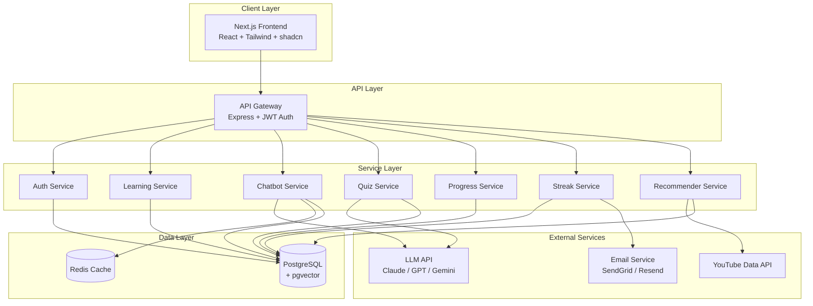
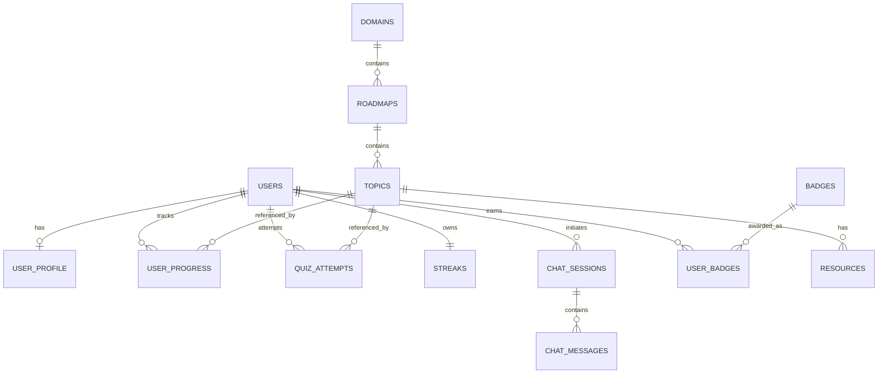

# SkillStreak AI — Project Planning Document

**Project Type:** Final-Year Engineering Project
**Document Version:** 1.0
**Date:** 2026-05-02
**Status:** Planning Phase

---

## Table of Contents

1. [Executive Summary](#1-executive-summary)
2. [Problem Statement](#2-problem-statement)
3. [Proposed Solution](#3-proposed-solution)
4. [Objectives](#4-objectives)
5. [Scope](#5-scope)
6. [Target Users](#6-target-users)
7. [Domains Covered](#7-domains-covered)
8. [Core Features](#8-core-features)
9. [AI Chatbot — Detailed Design](#9-ai-chatbot--detailed-design)
10. [System Architecture](#10-system-architecture)
11. [Module Breakdown](#11-module-breakdown)
12. [Database Design](#12-database-design)
13. [API Endpoint Design](#13-api-endpoint-design)
14. [User Flows](#14-user-flows)
15. [UI/UX Plan](#15-uiux-plan)
16. [Personalization Strategy](#16-personalization-strategy)
17. [Gamification Strategy](#17-gamification-strategy)
18. [Tech Stack](#18-tech-stack)
19. [File and Folder Structure](#19-file-and-folder-structure)
20. [Build Plan (14-Week Timeline)](#20-build-plan-14-week-timeline)
21. [Testing Strategy](#21-testing-strategy)
22. [Deployment Plan](#22-deployment-plan)
23. [Risks and Mitigations](#23-risks-and-mitigations)
24. [Future Scope](#24-future-scope)
25. [References](#25-references)

---

## 1. Executive Summary

**SkillStreak AI** is an AI-powered intelligent learning platform that helps users master modern technology domains in a structured, personalized, and consistent manner. The platform combines curated learning roadmaps, an AI chatbot tutor, interactive quizzes, smart resource recommendations, and a streak-based gamification system to keep learners engaged and progressing daily.

The core innovation is the **AI chatbot mentor**, which acts as a 24/7 learning companion. It explains concepts, answers doubts, generates quizzes, recommends resources, and adapts its responses to the user's current skill level and learning context.

---

## 2. Problem Statement

Self-learners in the technology field face the following challenges:

1. **No clear roadmap** — beginners do not know where to start or what to learn next.
2. **Scattered resources** — quality content is spread across YouTube, blogs, docs, and courses with no curation.
3. **No personalization** — existing platforms deliver static, generic learning paths regardless of the learner's level.
4. **Low motivation and consistency** — without daily structure or accountability, learners drop off within weeks.
5. **No real-time guidance** — when stuck, learners must search forums or wait for community responses.
6. **Information overload** — choosing between 50 tutorials on the same topic causes decision paralysis.

Existing platforms like Coursera, Udemy, and YouTube provide content but not direction. AI assistants like ChatGPT provide answers but no structured progression or progress tracking.

---

## 3. Proposed Solution

SkillStreak AI addresses these problems through five integrated components:

| Component | Role |
|---|---|
| **Curated Roadmaps** | Step-by-step structured learning paths for each domain |
| **AI Chatbot Mentor** | Always-available tutor for explanations, doubts, and guidance |
| **Adaptive Quizzes** | LLM-generated MCQs that test understanding and feed personalization |
| **Smart Resource Engine** | Curated YouTube videos and documentation links per topic |
| **Streak and Gamification System** | Daily streaks, XP, levels, and badges to drive consistency |

The platform turns passive content consumption into an active, guided, accountable learning loop.

---

## 4. Objectives

### Primary Objectives
- Build a full-stack web application that delivers personalized tech learning experiences.
- Integrate a large language model (LLM) to power an interactive AI tutor.
- Implement structured roadmaps for nine technology domains.
- Track user progress and adapt difficulty using AI/ML.
- Drive engagement through gamification mechanics (streaks, XP, badges).

### Secondary Objectives
- Demonstrate end-to-end software engineering: requirements, design, implementation, testing, deployment.
- Showcase AI integration beyond a simple chatbot wrapper (embedding-based topic recommender).
- Produce documentation suitable for academic evaluation: architecture diagram, ER diagram, DFD, API specification, test plan.

---

## 5. Scope

### In Scope
- Web application (responsive — desktop and mobile)
- User registration, authentication, and profile management
- Nine technology domains with structured roadmaps
- AI chatbot with concept explanation, roadmap generation, quiz generation, doubt solving, resource recommendation
- Quiz system with auto-grading and storage of attempts
- Progress tracking with analytics dashboard
- Daily streak system with streak freeze
- XP, levels, and badges
- Smart resource recommender (YouTube + documentation)
- Admin panel for content curation
- Email reminders for streak preservation

### Out of Scope (for MVP / academic submission)
- Native mobile apps (iOS/Android)
- Live coding labs / IDE / sandboxed code execution
- Live human tutor / mentor sessions
- Payment / subscription system
- Multi-language UI (English-only)
- Advanced certification / proctored exams
- Social features beyond a leaderboard (no chat between users, no forums)

---

## 6. Target Users

| Persona | Description | Primary Need |
|---|---|---|
| **Engineering Students** | Pursuing CS / IT / Electronics; preparing for placements | Structured prep across multiple domains |
| **Career Switchers** | Working professionals moving into tech roles | Clear roadmap from zero to job-ready |
| **Self-Learners** | Curious individuals without formal CS training | Friendly, paced, motivating learning |
| **Interview Aspirants** | Candidates preparing for tech interviews | Theory revision with quizzes |

---

## 7. Domains Covered

The platform supports **nine high-demand technology domains**:

| # | Domain | Sample Topics |
|---|---|---|
| 1 | **Cybersecurity** | CIA Triad, OWASP Top 10, Cryptography, Network Security, Ethical Hacking |
| 2 | **Artificial Intelligence** | Search Algorithms, Knowledge Representation, Expert Systems, NLP, Computer Vision |
| 3 | **Machine Learning** | Supervised/Unsupervised Learning, Regression, Classification, Neural Networks |
| 4 | **Data Science** | Statistics, Data Wrangling, Visualization, EDA, Feature Engineering |
| 5 | **Cloud Computing** | IaaS/PaaS/SaaS, AWS/Azure/GCP, Virtualization, Shared Responsibility Model |
| 6 | **DevOps** | CI/CD, Docker, Kubernetes, Infrastructure as Code, Monitoring |
| 7 | **Blockchain** | Cryptographic Hashing, Consensus, Smart Contracts, DeFi Concepts |
| 8 | **Web Development** | HTTP, REST, Frontend/Backend, Databases, Authentication |
| 9 | **Internet of Things (IoT)** | Sensors, Protocols (MQTT, CoAP), Edge Computing, IoT Architecture |

For the MVP, **five domains will be deeply curated**: Cybersecurity, Web Development, Artificial Intelligence, Machine Learning, and Data Science. These five are chosen for high demand and strong theory bases suited to structured roadmaps. The remaining four (Cloud Computing, DevOps, Blockchain, IoT) will be supported via the AI chatbot generating roadmaps, explanations, and quizzes on demand — still fully functional for users, just not pre-curated.

---

## 8. Core Features

### 8.1 Domain Selection
User chooses a domain from a visual gallery. Domains show difficulty rating, estimated duration, and topic count.

### 8.2 Structured Roadmaps
Each domain has a 60–90 day roadmap divided into three phases:
- **Foundations** (Days 1–30) — vocabulary, mental models
- **Core Concepts** (Days 31–60) — main subject matter
- **Advanced** (Days 61–90) — deeper theory, current trends

Roadmaps are visualized as a tree / linear path with locked and unlocked nodes.

### 8.3 Topic Pages
Each topic page shows:
- Topic title and short summary
- AI-generated explanation (cached after first generation)
- "Ask the chatbot" button (opens chat with topic context preloaded)
- Curated resources (3–5 YouTube videos + 2–3 documentation links)
- Quiz button (5 MCQs)
- Mark as complete

### 8.4 AI Chatbot (See Section 9 for full design)
Floating chat widget available across the platform. Domain-aware, topic-aware, and level-aware.

### 8.5 Interactive Quizzes
- 5 MCQs per topic, generated by the LLM with structured JSON output
- 60-second timer per question (optional)
- Immediate feedback with explanations
- Score stored in `quiz_attempts`; minimum 3/5 required to mark topic complete
- Quiz performance feeds analytics and "weak areas" detection

### 8.6 Smart Resource Recommendations
- YouTube Data API v3 search filtered by view count, language, and recency
- Curated official docs per topic (admin-maintained)
- Resources ranked by quality score (admin rating + click-through rate)

### 8.7 Progress Tracking and Analytics
Dashboard widgets:
- Topics completed / total
- Quiz average score
- Time spent per domain
- Weak areas (topics where user scored below 60%)
- GitHub-style activity heatmap
- Domain progress bars

### 8.8 Daily Streak System
- Streak increments when the user completes any of: 1 topic, 1 quiz, or 5 minutes of chatbot interaction
- Streak freeze: 1 freeze per week to protect against missed days
- Streak break leads to "comeback bonus" XP to reduce abandonment

### 8.9 Gamification (XP, Levels, Badges, Leaderboard)
See Section 17.

### 8.10 Notification System
- Daily email reminder at user-chosen time if streak is at risk
- Weekly progress summary email
- Badge / level-up notifications in-app

### 8.11 Admin Panel
- Add/edit domains, topics, roadmaps
- Upload curated resources
- View user metrics, retention, popular topics
- Approve or reject auto-generated content

---

## 9. AI Chatbot — Detailed Design

The AI chatbot is the centerpiece of the platform. It must feel like a knowledgeable, patient tutor.

### 9.1 Capabilities

| Capability | Description |
|---|---|
| **Concept Explanation** | Explain any topic at the user's level (beginner / intermediate / advanced) |
| **Roadmap Generation** | Generate custom roadmaps for any domain or sub-topic on request |
| **Quiz Generation** | Produce MCQs in structured JSON for any topic |
| **Doubt Solving** | Answer free-form user questions related to the current domain |
| **Resource Recommendation** | Suggest videos and documentation links |
| **Motivation** | Encouraging messages tied to streak status and progress |
| **Code Explanation (text only)** | Explain code snippets the user pastes (no execution) |

### 9.2 System Prompt Template

```
You are SkillStreak AI, a focused and friendly tech tutor.

USER CONTEXT:
- Name: {user_name}
- Skill level: {beginner | intermediate | advanced}
- Current domain: {domain}
- Current topic: {topic}
- Current streak: {streak_days} days
- Recent quiz scores: {recent_scores}

BEHAVIOR RULES:
- Adapt explanations to the user's skill level.
- Use simple language; avoid jargon unless the user is advanced.
- Give structured responses (lists, headings) where helpful.
- Be accurate. If unsure, say so — never invent.
- Stay within the technology domain the user is studying.
- End helpful responses with a short follow-up question or motivational nudge.

OUTPUT MODES (the routing layer will instruct you which to use):
- explain: prose + bullet points
- roadmap: JSON array of milestones
- quiz: JSON array of 5 MCQs with key
- recommend: JSON array of resources
- chat: free-form prose
```

### 9.3 Intent Routing Layer

Before sending the user message to the LLM, classify intent into one of:
- `explain` — "What is X?", "Explain X"
- `roadmap` — "Give me a roadmap for X", "What should I learn?"
- `quiz` — "Quiz me", "Test me on X"
- `recommend` — "Best resources for X", "Recommend a video"
- `doubt` — open-ended questions
- `motivational` — "I'm tired", "I want to quit"

Implementation: a lightweight LLM call with `temperature=0` and a constrained output schema, or rule-based regex for the demo. The routing decision determines which prompt template and output schema to use.

### 9.4 Structured Outputs

For `roadmap`, `quiz`, and `recommend` intents, force the LLM to return JSON via tool-use / JSON mode:

```json
{
  "type": "quiz",
  "topic": "CIA Triad",
  "questions": [
    {
      "q": "Which property ensures data is not altered?",
      "options": ["Confidentiality", "Integrity", "Availability", "Authentication"],
      "answer": 1,
      "explanation": "Integrity ensures data is not modified."
    }
  ]
}
```

This is what makes the chatbot feel like a *system* rather than a chat box — a critical talking point for the project report.

### 9.5 Caching Strategy

Common explanations (e.g., "Day 1: CIA Triad explanation for beginner") are cached in Redis keyed by `topic_id + level`. Cache TTL: 30 days. This reduces LLM cost by ~70% in expected usage.

### 9.6 Safety and Quality

- Filter user input for prompt-injection attempts (basic regex + length limit).
- Validate quiz answers in a second LLM call to catch hallucinated keys.
- Log all chat interactions for review and quality improvement.
- Show a disclaimer: "AI responses may occasionally be inaccurate. Verify critical information."

---

## 10. System Architecture

### 10.1 High-Level Architecture Diagram



### 10.2 Architecture Style
- **Layered monolith** — single backend with clear service-layer separation. Easier to demo, deploy, and document than microservices, while still showing strong design principles.
- **Stateless API** — JWT tokens; no server-side sessions. Allows horizontal scaling.
- **External AI as a managed dependency** — LLM is a service-layer client, not embedded in the app.

### 10.3 Data Flow Example: User Asks Chatbot "Explain CIA Triad"

```
1. UI sends POST /api/chat { message, sessionId }
2. Auth middleware validates JWT
3. Chat controller fetches session + topic context from DB
4. Intent router classifies → "explain"
5. Cache lookup: "topic:cia-triad:level:beginner"
   - HIT  → return cached response
   - MISS → call LLM → store in cache → return
6. Persist message pair to chat_messages
7. Stream response to UI via Server-Sent Events
8. Update user XP and streak in background job
```

---

## 11. Module Breakdown

| # | Module | Purpose | Key Components |
|---|---|---|---|
| 1 | **Auth & User Management** | Registration, login, JWT, profile | bcrypt hashing, JWT, password reset |
| 2 | **Domain & Roadmap** | Domain catalog, curated roadmaps | DB-backed roadmaps + LLM-generated variants |
| 3 | **Learning Content** | Topic pages, AI explanations | LLM service, Redis cache |
| 4 | **AI Chatbot** | Conversational tutor | Intent router, prompt templates, streaming responses |
| 5 | **Quiz Engine** | MCQ generation, scoring, storage | LLM JSON mode, validator, scorer |
| 6 | **Progress & Analytics** | Track completion, scores, time | Dashboard queries, aggregations |
| 7 | **Streak & Gamification** | Streak logic, XP, levels, badges | Daily cron checker, XP rules engine |
| 8 | **Resource Recommender** | YouTube + docs suggestions | YouTube API, embedding-based ranking |
| 9 | **Notifications** | Email reminders | SendGrid / Resend, cron jobs |
| 10 | **Admin Panel** | Content curation, metrics | Role-gated routes, separate UI section |

### 11a. Additional AI Component (For Viva Defense)

To strengthen the "AI" in SkillStreak AI beyond a chat wrapper:

#### Topic Recommender (Embedding-Based)
- Embed every topic using the LLM's embedding API (e.g., `text-embedding-3-small`)
- Embed the user's progress profile (concatenated completed topics)
- Compute cosine similarity in pgvector
- Return top-K topics ranked by similarity + curriculum order

This provides a "Recommended Next" experience beyond the linear roadmap and gives the project a defensible non-chatbot AI component for viva discussions.

---

## 12. Database Design

### 12.1 ER Diagram



### 12.2 Key Tables

```sql
-- Users
users (
  id UUID PRIMARY KEY,
  email VARCHAR(255) UNIQUE NOT NULL,
  password_hash VARCHAR(255) NOT NULL,
  name VARCHAR(100) NOT NULL,
  level INT DEFAULT 1,
  xp INT DEFAULT 0,
  role VARCHAR(20) DEFAULT 'user',  -- 'user' | 'admin'
  created_at TIMESTAMP DEFAULT NOW()
)

user_profile (
  user_id UUID PRIMARY KEY REFERENCES users(id),
  prior_level VARCHAR(20),       -- 'none' | 'some' | 'experienced'
  goal VARCHAR(50),              -- 'interview' | 'awareness' | 'curiosity'
  pace VARCHAR(20),              -- 'relaxed' | 'standard' | 'intense'
  preferred_domains UUID[]
)

-- Content
domains (
  id UUID PRIMARY KEY,
  name VARCHAR(100) UNIQUE NOT NULL,
  slug VARCHAR(100) UNIQUE NOT NULL,
  description TEXT,
  icon VARCHAR(255),
  difficulty VARCHAR(20),
  is_curated BOOLEAN DEFAULT false
)

roadmaps (
  id UUID PRIMARY KEY,
  domain_id UUID REFERENCES domains(id),
  title VARCHAR(255) NOT NULL,
  total_topics INT,
  estimated_days INT
)

topics (
  id UUID PRIMARY KEY,
  roadmap_id UUID REFERENCES roadmaps(id),
  order_index INT NOT NULL,
  title VARCHAR(255) NOT NULL,
  summary TEXT,
  difficulty VARCHAR(20),         -- 'easy' | 'standard' | 'hard'
  embedding VECTOR(1536),         -- pgvector for recommender
  UNIQUE (roadmap_id, order_index)
)

resources (
  id UUID PRIMARY KEY,
  topic_id UUID REFERENCES topics(id),
  type VARCHAR(20),               -- 'youtube' | 'doc' | 'article'
  title VARCHAR(255),
  url TEXT NOT NULL,
  source VARCHAR(100),
  quality_score FLOAT DEFAULT 0
)

-- Progress
user_progress (
  id UUID PRIMARY KEY,
  user_id UUID REFERENCES users(id),
  topic_id UUID REFERENCES topics(id),
  status VARCHAR(20),             -- 'not_started' | 'in_progress' | 'completed'
  best_score INT,
  time_spent_seconds INT DEFAULT 0,
  completed_at TIMESTAMP,
  UNIQUE (user_id, topic_id)
)

quiz_attempts (
  id UUID PRIMARY KEY,
  user_id UUID REFERENCES users(id),
  topic_id UUID REFERENCES topics(id),
  questions JSONB NOT NULL,
  user_answers JSONB NOT NULL,
  score INT NOT NULL,
  attempted_at TIMESTAMP DEFAULT NOW()
)

-- Gamification
streaks (
  user_id UUID PRIMARY KEY REFERENCES users(id),
  current_streak INT DEFAULT 0,
  longest_streak INT DEFAULT 0,
  last_active_date DATE,
  freezes_left INT DEFAULT 1
)

badges (
  id UUID PRIMARY KEY,
  name VARCHAR(100) UNIQUE,
  description TEXT,
  criteria JSONB,                 -- e.g., { "streak_days": 7 }
  icon VARCHAR(255)
)

user_badges (
  user_id UUID REFERENCES users(id),
  badge_id UUID REFERENCES badges(id),
  earned_at TIMESTAMP DEFAULT NOW(),
  PRIMARY KEY (user_id, badge_id)
)

-- Chatbot
chat_sessions (
  id UUID PRIMARY KEY,
  user_id UUID REFERENCES users(id),
  topic_id UUID REFERENCES topics(id),  -- nullable
  title VARCHAR(255),
  created_at TIMESTAMP DEFAULT NOW()
)

chat_messages (
  id UUID PRIMARY KEY,
  session_id UUID REFERENCES chat_sessions(id),
  role VARCHAR(20),               -- 'user' | 'assistant' | 'system'
  content TEXT NOT NULL,
  tokens INT,
  intent VARCHAR(30),             -- 'explain' | 'quiz' | 'roadmap' | ...
  created_at TIMESTAMP DEFAULT NOW()
)
```

### 12.3 Indexes
- `user_progress (user_id, topic_id)`
- `chat_messages (session_id, created_at)`
- `quiz_attempts (user_id, topic_id, attempted_at DESC)`
- `topics USING ivfflat (embedding vector_cosine_ops)` — for recommender

---

## 13. API Endpoint Design

| Method | Endpoint | Purpose |
|---|---|---|
| **Auth** | | |
| POST | `/api/auth/register` | Create user |
| POST | `/api/auth/login` | Issue JWT |
| GET | `/api/auth/me` | Current user |
| POST | `/api/auth/logout` | Invalidate session |
| **Domains & Roadmaps** | | |
| GET | `/api/domains` | List all domains |
| GET | `/api/domains/:slug` | Domain details |
| GET | `/api/roadmap/:domainSlug` | Curated roadmap |
| POST | `/api/roadmap/generate` | LLM-generate custom roadmap |
| **Topics** | | |
| GET | `/api/topics/:id` | Topic content |
| POST | `/api/topics/:id/explain` | LLM explanation (cached) |
| POST | `/api/topics/:id/complete` | Mark complete |
| **Chatbot** | | |
| POST | `/api/chat` | Send message (SSE streaming) |
| GET | `/api/chat/sessions` | List sessions |
| GET | `/api/chat/sessions/:id` | Session messages |
| DELETE | `/api/chat/sessions/:id` | Delete session |
| **Quiz** | | |
| POST | `/api/quiz/generate` | Generate quiz for topic |
| POST | `/api/quiz/:id/submit` | Submit answers, get score |
| GET | `/api/quiz/history` | Past attempts |
| **Progress** | | |
| GET | `/api/progress` | Overall progress |
| GET | `/api/progress/:domainSlug` | Domain progress |
| GET | `/api/analytics/heatmap` | Activity heatmap data |
| **Streak & Gamification** | | |
| GET | `/api/streak` | Current streak |
| POST | `/api/streak/freeze` | Use a freeze |
| GET | `/api/leaderboard` | Weekly XP leaderboard |
| GET | `/api/badges` | User's earned badges |
| **Resources** | | |
| GET | `/api/resources/:topicId` | Resources for topic |
| **Admin** | | |
| POST | `/api/admin/topics` | Create topic |
| PUT | `/api/admin/topics/:id` | Edit topic |
| GET | `/api/admin/metrics` | Platform metrics |

---

## 14. User Flows

### 14.1 New User Onboarding
```
Landing Page
  → Sign Up (email + password)
  → Onboarding Survey (3 questions: level, goal, pace)
  → Domain Selection Gallery
  → First Topic Page (explanation auto-shown)
  → Optional: Talk to Chatbot
  → Take Quiz
  → Mark Complete → Streak +1, XP +10 → "Day 1 streak!"
  → Dashboard
```

### 14.2 Returning User — Daily Session
```
Login (or auto via JWT)
  → Dashboard shows: streak banner, today's topic, weak areas
  → Click "Continue Today's Topic"
  → Topic Page → Explanation → Resources → Quiz
  → Mark Complete → Streak +1, XP +10
  → Optional: chatbot for doubts
  → Logout
```

### 14.3 Doubt-Solving Flow
```
On any page → Click chat icon (always-visible)
  → Chat opens with topic context preloaded
  → User types question
  → Intent router classifies (explain / quiz / recommend / doubt)
  → Cache check → LLM call (streamed) → response
  → User can bookmark useful responses
```

---

## 15. UI/UX Plan

### 15.1 Pages
1. **Landing** — value proposition, demo video, CTA
2. **Sign Up / Login**
3. **Onboarding Survey**
4. **Dashboard** — streak, today's topic, progress widgets, leaderboard preview
5. **Domains Gallery** — card grid with 9 domains
6. **Domain Page** — roadmap visualization
7. **Topic Page** — explanation, resources, quiz button, chatbot panel
8. **Quiz Page** — one question at a time, timer, immediate feedback
9. **Chatbot Page** — full-screen chat with session sidebar
10. **Progress / Analytics** — heatmap, charts, weak areas
11. **Profile / Settings** — edit profile, notification preferences, theme
12. **Leaderboard** — weekly XP rankings
13. **Admin Panel** (separate area)

### 15.2 Design System
- **Primary palette:** Indigo `#6366F1` + violet `#8B5CF6` gradient as accent; neutral slate scale for backgrounds
- **Typography:** Inter (UI) + Cal Sans or Geist (display headings); JetBrains Mono for code
- **Components:** shadcn/ui primitives + Tailwind utility classes + custom branded variants
- **Dark mode:** **required and beautiful** — not just inverted; designed as a first-class theme with its own gradient system
- **Mobile:** fully responsive, mobile-first design (Tailwind breakpoints)
- **Iconography:** Lucide icons (consistent stroke weight)
- **Spacing scale:** strict 4-pt grid; consistent throughout

### 15.3 Key UX Patterns
- Floating chatbot button (bottom-right, always visible) with a subtle pulse animation when idle
- Streak banner pinned to top of dashboard with flame icon that scales with streak length
- Locked roadmap nodes with subtle lock icon and shimmer-on-hover
- Confetti animation on level-up and badge earned
- Skeleton loaders during LLM streaming
- Toast notifications for all async actions (Sonner)
- Page transitions on route changes (fade + slide)

### 15.4 Frontend Excellence — The Bar We're Targeting

The frontend is a **first-class deliverable**, not a thin shell on the backend. The goal is a website that examiners and viewers immediately recognize as production-quality.

#### Visual Polish Requirements
- **Hero section** on landing page with animated gradient background, headline animation, and a 3D / Lottie illustration
- **Glassmorphism** treatment on key cards (chatbot panel, streak card, leaderboard)
- **Subtle gradients** on CTAs, badges, and active states
- **Custom illustrations** for empty states (no topics yet, no streak yet, no badges yet)
- **Micro-interactions** on every clickable element — hover lifts, press scale, ripple effects
- **Smooth scroll** with progress indicator on long pages
- **Beautiful 404 / 500 / offline pages** — themed, not default browser pages

#### Animation Stack
- **Framer Motion** as the primary animation library
- **Lottie** for hero illustrations and empty-state animations
- **Tailwind animations** for utility-level transitions
- **CSS keyframes** for the streak flame, level-up burst, XP gain
- All animations respect `prefers-reduced-motion`

#### Chatbot UI (Crown Jewel)
The chatbot is the most-used surface — it must feel premium:
- **Streaming text** with typewriter effect (token-by-token render)
- **Markdown rendering** with syntax-highlighted code blocks (Shiki)
- **Copy button** on every code block
- **Bot typing indicator** (3 animated dots) before stream begins
- **Message bubbles** with subtle gradient on assistant messages
- **Auto-scroll** with user-override (don't fight the user if they scrolled up)
- **Suggested follow-up chips** below each AI response
- **Voice input button** (Web Speech API) — easy add, big perceived value
- **Session sidebar** with search, rename, and delete
- **"Regenerate response"** button on assistant messages

#### Dashboard Polish
- **GitHub-style heatmap** with smooth color transitions and tooltips on hover
- **Animated XP bar** that fills smoothly when XP is awarded
- **Domain progress rings** (circular progress) with gradient strokes
- **Today's topic card** with gradient border and subtle hover lift
- **Live streak counter** that animates +1 in real time when earned

#### Quiz UI
- **Card-flip animation** on question reveal
- **Color feedback** on answer selection (green correct / red incorrect with shake)
- **Confidence slider** before submitting (optional, fancy)
- **Progress bar** showing question N of 5
- **Final result screen** with confetti on perfect score

#### Onboarding (First Impression)
- **Multi-step wizard** with progress indicator
- **Slide transitions** between steps
- **Personality** in copy ("Let's get you started!" not "Step 1")
- **Domain selection** as a beautiful card grid with hover preview

#### Performance Targets
- **Lighthouse score:** 95+ on Performance, Accessibility, Best Practices, SEO
- **First Contentful Paint:** < 1.0s
- **Time to Interactive:** < 2.5s
- **Smooth 60fps scrolling** on all pages
- **Image optimization:** Next.js `<Image>` everywhere; WebP/AVIF with proper sizing
- **Code splitting:** route-based + dynamic imports for chat/quiz/admin
- **Font loading:** `next/font` with display swap
- **Bundle size budget:** initial JS < 200KB gzipped per route

#### Accessibility (Non-Negotiable)
- **WCAG 2.1 AA** minimum
- **Keyboard navigation** for every interactive element
- **Focus rings** on all focusable elements (custom-styled, visible)
- **Screen-reader labels** on icon-only buttons
- **Color contrast** ratios checked for both light and dark themes
- **Reduced motion** respected throughout

#### Libraries (Frontend Stack)
| Purpose | Library |
|---|---|
| Framework | Next.js 14 (App Router) |
| Styling | Tailwind CSS |
| Components | shadcn/ui |
| Animation | Framer Motion + Lottie |
| Icons | Lucide |
| Charts | Recharts |
| Markdown | react-markdown + remark-gfm |
| Syntax highlighting | Shiki |
| Toasts | Sonner |
| Forms | React Hook Form + Zod |
| State (server) | TanStack Query |
| State (client) | Zustand |
| Streaming | EventSource / `useChat` pattern |

This level of frontend polish is what separates a final-year project that scores 7/10 from one that scores 9/10. Allocate Weeks 10 and 12 specifically to polish — animations, micro-interactions, accessibility audit, and Lighthouse tuning.

---

## 16. Personalization Strategy

Personalization is implemented through **three concrete mechanisms**, each defensible in viva:

| # | Mechanism | What It Personalizes |
|---|---|---|
| 1 | **Onboarding Survey** | Roadmap entry point and pace — based on prior level, goal, pace |
| 2 | **Chatbot Context Injection** | Every LLM call includes user level, current topic, recent quiz scores |
| 3 | **Topic Recommender** (embeddings) | Suggests "next topics" via cosine similarity in pgvector |

This is critical for the project report — examiners will ask "what does personalization actually do?" and these three answers directly address that.

---

## 17. Gamification Strategy

### 17.1 XP System
| Action | XP |
|---|---|
| Complete topic | +10 |
| Pass quiz (3/5+) | +15 |
| Perfect quiz (5/5) | +25 |
| Daily streak maintained | +5 |
| First topic of the day | +10 (bonus) |
| Help via chatbot (5+ msgs) | +5 |

### 17.2 Levels
Levels follow a logarithmic XP curve:
- Level 1: 0 XP
- Level 2: 100 XP
- Level 3: 250 XP
- Level N: `100 * N * log2(N+1)` XP

### 17.3 Streaks
- Increments once per day on any qualifying action
- Streak freezes: 1 free per week (max 2 banked)
- Streak break → "comeback bonus" (+50 XP) on next day to encourage return

### 17.4 Badges
| Badge | Criteria |
|---|---|
| **First Step** | Complete first topic |
| **Week Warrior** | 7-day streak |
| **Marathoner** | 30-day streak |
| **Quiz Master** | 10 perfect quizzes |
| **Domain Pioneer** | Complete first domain roadmap |
| **Polyglot** | Start 5+ domains |
| **Insomniac** | Study after midnight |
| **Early Bird** | Study before 7 AM |

### 17.5 Weekly Leaderboard
Top 10 users by XP earned this week. Resets every Monday. Encourages competition without being too aggressive.

---

## 18. Tech Stack

| Layer | Technology | Why |
|---|---|---|
| **Frontend Framework** | Next.js 14 (App Router) | SSR, file-based routing, professional |
| **Styling** | Tailwind CSS + shadcn/ui | Modern, fast, recognized by examiners |
| **Frontend State** | React Query + Zustand | Server-state + client-state cleanly separated |
| **Backend** | Node.js + Express + TypeScript | Familiar, fast to ship |
| **ORM** | Prisma | Type-safe queries, auto-migrations, great DX |
| **Database** | PostgreSQL (with pgvector) | Relational + vector search in one engine |
| **Cache** | Redis (Upstash free tier) | LLM response caching, sessions |
| **Auth** | JWT + bcrypt | Standard, demonstrable |
| **LLM Provider** | Claude / OpenAI / Gemini | Pick one based on free credits |
| **External APIs** | YouTube Data API v3 | Resource recommender |
| **Email** | Resend or SendGrid | Streak reminders |
| **Hosting (Frontend)** | Vercel | Free, integrates with Next.js |
| **Hosting (Backend)** | Render / Railway | Free tier sufficient for demo |
| **DB Hosting** | Supabase / Neon | Free Postgres with pgvector |
| **Version Control** | Git + GitHub | Required for academic submission |
| **CI/CD** | GitHub Actions | Auto-deploy on push to main |
| **Monitoring** | Sentry (free tier) | Production-quality touch |

---

## 19. File and Folder Structure

```
skillstreak-ai/
├── README.md
├── .gitignore
├── docker-compose.yml                    # Local dev: postgres + redis
├── package.json                          # Workspaces root
│
├── frontend/                             # Next.js 14 app
│   ├── app/
│   │   ├── (auth)/
│   │   │   ├── login/page.tsx
│   │   │   ├── register/page.tsx
│   │   │   └── layout.tsx
│   │   ├── (dashboard)/
│   │   │   ├── dashboard/page.tsx
│   │   │   ├── domains/page.tsx
│   │   │   ├── domains/[slug]/page.tsx
│   │   │   ├── topic/[id]/page.tsx
│   │   │   ├── quiz/[topicId]/page.tsx
│   │   │   ├── chatbot/page.tsx
│   │   │   ├── progress/page.tsx
│   │   │   ├── leaderboard/page.tsx
│   │   │   ├── profile/page.tsx
│   │   │   └── layout.tsx
│   │   ├── (admin)/
│   │   │   └── admin/page.tsx
│   │   ├── api/                          # Optional thin proxies
│   │   ├── globals.css
│   │   ├── layout.tsx
│   │   └── page.tsx                      # Landing
│   │
│   ├── components/
│   │   ├── ui/                           # shadcn primitives
│   │   ├── chatbot/
│   │   │   ├── ChatWidget.tsx            # Floating chat
│   │   │   ├── ChatWindow.tsx
│   │   │   ├── MessageBubble.tsx
│   │   │   ├── ChatInput.tsx
│   │   │   └── SessionSidebar.tsx
│   │   ├── roadmap/
│   │   │   ├── RoadmapTree.tsx
│   │   │   ├── TopicCard.tsx
│   │   │   └── PhaseHeader.tsx
│   │   ├── quiz/
│   │   │   ├── QuizPlayer.tsx
│   │   │   ├── QuestionCard.tsx
│   │   │   ├── QuizResult.tsx
│   │   │   └── QuizTimer.tsx
│   │   ├── progress/
│   │   │   ├── StreakBanner.tsx
│   │   │   ├── XPBar.tsx
│   │   │   ├── Heatmap.tsx
│   │   │   ├── DomainProgress.tsx
│   │   │   └── WeakAreasCard.tsx
│   │   ├── gamification/
│   │   │   ├── BadgeCard.tsx
│   │   │   ├── LevelUpModal.tsx
│   │   │   └── LeaderboardRow.tsx
│   │   └── shared/
│   │       ├── Navbar.tsx
│   │       ├── Sidebar.tsx
│   │       ├── Footer.tsx
│   │       ├── ThemeToggle.tsx
│   │       └── ConfettiOverlay.tsx
│   │
│   ├── lib/
│   │   ├── api.ts                        # Axios / fetch client
│   │   ├── auth.ts                       # Token handling
│   │   ├── streamingClient.ts            # SSE chat
│   │   └── utils.ts
│   │
│   ├── hooks/
│   │   ├── useUser.ts
│   │   ├── useChat.ts
│   │   ├── useStreak.ts
│   │   ├── useProgress.ts
│   │   └── useQuiz.ts
│   │
│   ├── store/
│   │   ├── userStore.ts                  # Zustand
│   │   └── chatStore.ts
│   │
│   ├── types/
│   │   ├── user.ts
│   │   ├── chat.ts
│   │   ├── quiz.ts
│   │   └── domain.ts
│   │
│   ├── public/
│   │   ├── icons/
│   │   └── images/
│   │
│   ├── next.config.js
│   ├── tailwind.config.ts
│   ├── tsconfig.json
│   └── package.json
│
├── backend/                              # Express + TypeScript
│   ├── src/
│   │   ├── config/
│   │   │   ├── env.ts
│   │   │   ├── db.ts
│   │   │   ├── redis.ts
│   │   │   └── llm.ts
│   │   │
│   │   ├── routes/
│   │   │   ├── index.ts
│   │   │   ├── auth.routes.ts
│   │   │   ├── domain.routes.ts
│   │   │   ├── topic.routes.ts
│   │   │   ├── chat.routes.ts
│   │   │   ├── quiz.routes.ts
│   │   │   ├── progress.routes.ts
│   │   │   ├── streak.routes.ts
│   │   │   ├── resource.routes.ts
│   │   │   └── admin.routes.ts
│   │   │
│   │   ├── controllers/
│   │   │   ├── auth.controller.ts
│   │   │   ├── domain.controller.ts
│   │   │   ├── topic.controller.ts
│   │   │   ├── chat.controller.ts
│   │   │   ├── quiz.controller.ts
│   │   │   ├── progress.controller.ts
│   │   │   ├── streak.controller.ts
│   │   │   └── admin.controller.ts
│   │   │
│   │   ├── services/
│   │   │   ├── auth.service.ts
│   │   │   ├── llm.service.ts            # LLM API wrapper
│   │   │   ├── chat.service.ts           # Intent routing + streaming
│   │   │   ├── quiz.service.ts           # Generate + validate
│   │   │   ├── recommender.service.ts    # Embeddings + ranking
│   │   │   ├── streak.service.ts
│   │   │   ├── youtube.service.ts
│   │   │   ├── email.service.ts
│   │   │   └── cache.service.ts
│   │   │
│   │   ├── middleware/
│   │   │   ├── auth.middleware.ts
│   │   │   ├── error.middleware.ts
│   │   │   ├── validate.middleware.ts
│   │   │   └── rateLimit.middleware.ts
│   │   │
│   │   ├── prompts/
│   │   │   ├── system.prompt.ts
│   │   │   ├── explain.prompt.ts
│   │   │   ├── quiz.prompt.ts
│   │   │   ├── roadmap.prompt.ts
│   │   │   └── intent.prompt.ts
│   │   │
│   │   ├── jobs/
│   │   │   ├── streakReminder.job.ts
│   │   │   ├── streakReset.job.ts
│   │   │   └── weeklyDigest.job.ts
│   │   │
│   │   ├── utils/
│   │   │   ├── jwt.util.ts
│   │   │   ├── password.util.ts
│   │   │   ├── logger.util.ts
│   │   │   └── validators.util.ts
│   │   │
│   │   ├── types/
│   │   │   ├── express.d.ts
│   │   │   └── llm.types.ts
│   │   │
│   │   ├── app.ts
│   │   └── server.ts
│   │
│   ├── prisma/
│   │   ├── schema.prisma
│   │   ├── migrations/
│   │   └── seed.ts                       # Seed 9 domains + 5 deep roadmaps
│   │
│   ├── tests/
│   │   ├── auth.test.ts
│   │   ├── chat.test.ts
│   │   └── quiz.test.ts
│   │
│   ├── .env.example
│   ├── tsconfig.json
│   ├── jest.config.js
│   └── package.json
│
├── docs/
│   ├── architecture.md
│   ├── api.md
│   ├── database.md
│   ├── deployment.md
│   └── diagrams/
│       ├── architecture.png
│       ├── er-diagram.png
│       ├── user-flow.png
│       └── sequence-chatbot.png
│
└── planning/
    └── SKILLSTREAK_AI_PLANNING.md        # this document
```

---

## 20. Build Plan (14-Week Timeline)

| Week | Phase | Tasks | Deliverable |
|---|---|---|---|
| **1** | Setup | Repo init, monorepo structure, README, .env templates, ER + architecture diagrams | Project skeleton + diagrams |
| **2** | Auth + UI Shell | Signup/login backend + frontend, JWT, dashboard skeleton, navbar, theme toggle, dark mode | Working auth flow |
| **3** | Domain Seeding (Phase 1) | Seed all 9 domains; build deep roadmaps for **Cybersecurity** and **Web Development**; domain gallery; roadmap visualization | 2 of 5 deep domains live |
| **4** | Domain Seeding (Phase 2) + Topic Page + LLM v1 | Build deep roadmaps for **AI**, **Machine Learning**, and **Data Science**; topic page UI; first LLM service integration; explanation endpoint with caching | All 5 deep domains live; topics show AI explanations |
| **5** | Chatbot v1 | Streaming chat UI, system prompt, message persistence, session sidebar | Working chatbot |
| **6** | Quiz Engine | LLM-generated MCQs (JSON), quiz UI with timer, scoring, attempt storage | Quizzes functional |
| **7** | Progress Tracking | Mark complete, dashboard widgets, domain progress bars, basic analytics | Dashboard working |
| **8** | Streaks + Gamification | Streak logic, XP rules engine, levels, badges, level-up modal, streak freeze | Full gamification live |
| **9** | Recommender | YouTube API integration, topic embeddings, pgvector setup, top-K resource fetcher | Smart resources |
| **10** | Frontend Polish Sprint I | Framer Motion animations across the app, page transitions, micro-interactions, hero section, loading states, custom illustrations | High-polish UI |
| **11** | Notifications + Admin | Email service, daily streak reminder cron, weekly digest, admin panel for content curation | Full feature set |
| **12** | Polish + Mobile | Mobile responsive, heatmap, leaderboard, confetti, skeleton loaders, accessibility audit | Production-quality UI |
| **13** | Testing + Docs | Backend unit tests, manual QA across all flows, write architecture/API/database docs | Test coverage + docs |
| **14** | Final Report + Demo | Final project report, slides, screen-recorded demo, viva preparation, deploy to production | Submission package |

### Milestones
- **End of Week 4:** All 5 deep domains seeded; first end-to-end vertical slice working (login → topic → AI explanation)
- **End of Week 8:** Full feature set demonstrable on Cybersecurity + one of AI/ML/Data Science
- **End of Week 12:** All 9 domains accessible (5 deep + 4 chatbot-served), polish complete
- **End of Week 14:** Submission-ready

---

## 21. Testing Strategy

| Test Type | Scope | Tools |
|---|---|---|
| **Unit Tests** | Service layer functions (auth, quiz scoring, streak logic) | Jest |
| **Integration Tests** | API endpoints with test database | Supertest + Jest |
| **LLM Tests** | Snapshot tests for prompt outputs (regression check) | Jest custom matchers |
| **Manual QA** | Full user flows on staging | Test plan checklist |
| **Load Test (light)** | Chat endpoint under simulated 50 concurrent users | k6 (optional) |

Aim for ~60% backend coverage. Examiners care more about *quality* of tests than quantity.

---

## 22. Deployment Plan

| Environment | Frontend | Backend | Database |
|---|---|---|---|
| **Local Dev** | `next dev` on `localhost:3000` | `tsx watch src/server.ts` on `localhost:4000` | Docker Compose: Postgres + Redis |
| **Staging** | Vercel preview deployments | Render (free tier) | Neon (free Postgres) + Upstash (free Redis) |
| **Production** | Vercel production | Render starter | Neon + Upstash |

**CI/CD**: GitHub Actions workflow on push to `main`:
1. Lint and type-check
2. Run tests
3. Deploy frontend to Vercel
4. Deploy backend to Render
5. Run Prisma migrations

---

## 23. Risks and Mitigations

| Risk | Impact | Mitigation |
|---|---|---|
| **LLM hallucination in quizzes** | Wrong answers marked correct | Validate answer key in second LLM call; flag mismatches |
| **LLM API cost** | Expensive at scale | Aggressive Redis caching; use cheap-tier models (Haiku, GPT-4o-mini, Gemini Flash) |
| **Cold-start personalization** | New users have no signal | Onboarding survey provides bootstrap data |
| **Content quality variance** | Inconsistent explanations | Cache approved explanations; admin can flag and regenerate bad ones |
| **Streak shame** | Users quit after losing long streaks | Streak freezes + comeback bonus |
| **Prompt injection in chat** | Malicious users bypass guardrails | Input sanitization, length limit, system prompt re-anchoring |
| **YouTube API quota** | Free quota of 10,000 units/day | Cache search results in DB; refresh weekly |
| **Single-domain depth** | 9 domains, 5 deeply curated | Remaining 4 domains served via on-demand chatbot generation — frame architecture as "extensible" and document this as a deliberate design choice |
| **Content seeding load** | 5 deep roadmaps = ~300–450 topics to seed | Use LLM to draft roadmaps + topic summaries, then admin-review before publishing; spread seeding across Weeks 3–8 |
| **Team coordination** | Multi-developer team conflicts | Clear module ownership; weekly sync; PR-based workflow |

---

## 24. Future Scope

Items deliberately out of MVP scope but worth mentioning in the report:

1. **Hands-on coding labs** — sandboxed code execution for practical exercises
2. **Native mobile apps** — React Native versions for iOS / Android
3. **Multi-language UI** — Hindi, Tamil, Telugu, etc.
4. **Voice mode** — speak with the chatbot via Web Speech API
5. **Peer learning groups** — friends, study circles, group challenges
6. **Verified certificates** — proctored exams + shareable certificates
7. **Mentor matching** — connect users with human mentors
8. **Job board integration** — apply to jobs based on completed roadmaps
9. **Personalized ML model per user** — fine-tuned tutor adapted over time
10. **Offline mode** — downloadable lessons for low-bandwidth users

---

## 25. References

### APIs and Documentation
- Anthropic Claude API — `https://docs.anthropic.com`
- OpenAI API — `https://platform.openai.com/docs`
- Google Gemini API — `https://ai.google.dev/`
- YouTube Data API v3 — `https://developers.google.com/youtube/v3`
- Next.js Documentation — `https://nextjs.org/docs`
- Prisma Documentation — `https://www.prisma.io/docs`
- pgvector — `https://github.com/pgvector/pgvector`

### Inspirations
- Duolingo — gamification mechanics
- roadmap.sh — visual roadmaps
- Brilliant.org — bite-sized concept lessons
- Mimo / Sololearn — gamified coding education

### Academic / Technical Concepts
- Retrieval-Augmented Generation (RAG)
- Cosine Similarity for Recommender Systems
- Spaced Repetition Systems
- JWT Authentication
- Server-Sent Events (SSE) for streaming

---

## Appendix A — Sample Prompt Templates

### Explain Prompt
```
You are a tech tutor. Explain "{topic_title}" to a {level} learner.
Structure: 1-line definition → 3 key points → 1 real-world example → 1 common misconception.
Length: 150-250 words. Plain language.
```

### Quiz Generation Prompt
```
Generate 5 multiple-choice questions about "{topic_title}" at {level} difficulty.
Each question must have exactly 4 options. Specify the correct answer index (0-3).
Provide a 1-line explanation for each correct answer.
Return ONLY valid JSON in this schema:
{
  "questions": [
    { "q": "...", "options": ["A","B","C","D"], "answer": 0, "explanation": "..." }
  ]
}
```

### Roadmap Generation Prompt
```
Generate a {duration}-day learning roadmap for "{domain}" at {level} level.
Output as JSON array of milestones, each with: day, topic, summary (1 line), difficulty.
Phase the roadmap: Foundations (first 1/3), Core (middle 1/3), Advanced (last 1/3).
```

---

## Appendix B — Definition of Done (per feature)

A feature is "done" when all of the following are true:
1. Backend endpoint implemented and tested
2. Frontend UI implemented and connected to backend
3. Loading and error states handled
4. Mobile-responsive
5. Dark mode supported
6. Documented in `/docs/api.md` (if API)
7. Manually QA'd through full user flow
8. Pushed to main and deployed to staging

---

**End of Planning Document**

This document should be treated as the single source of truth for the planning phase. Updates during implementation should be tracked via git commits to this file.
